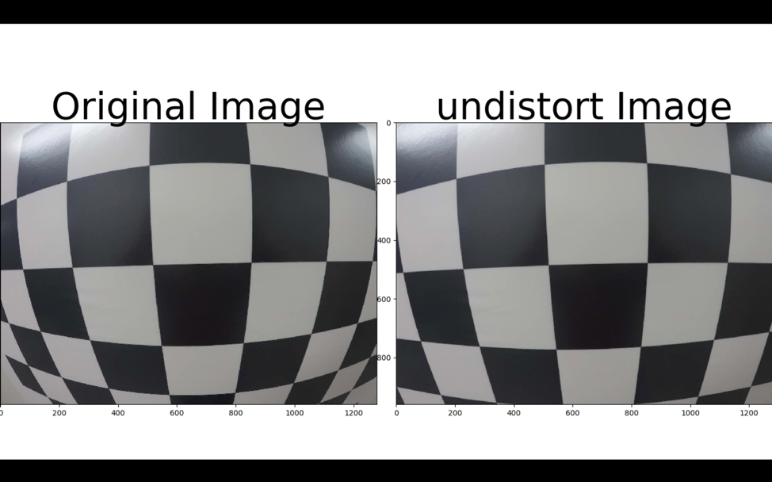
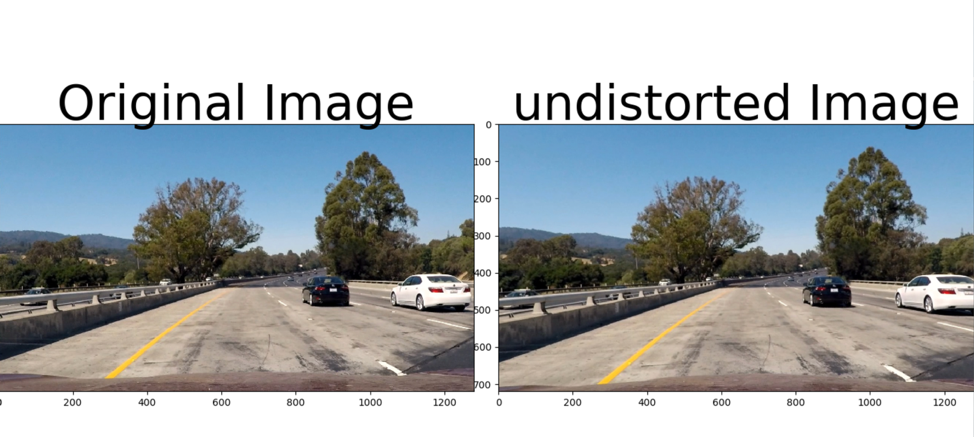
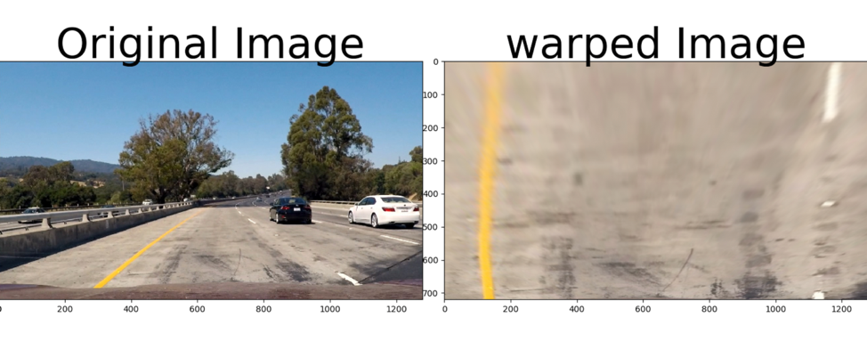
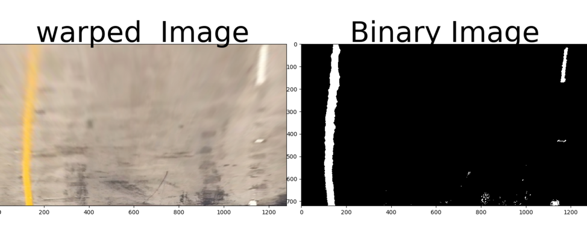
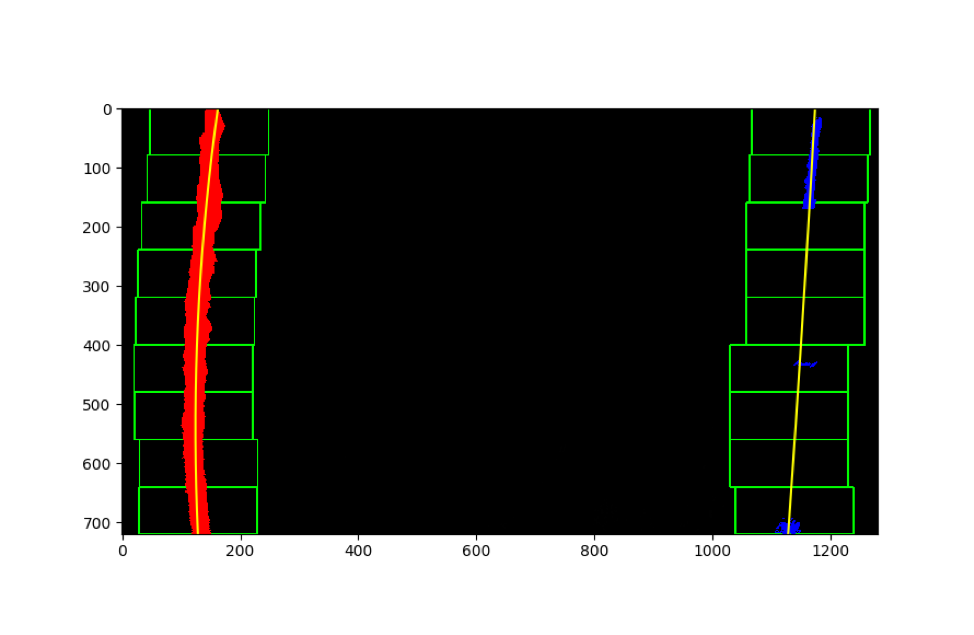
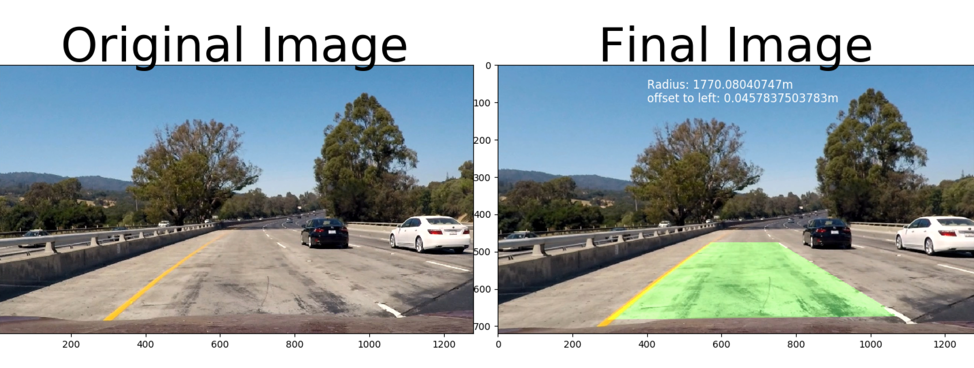

## Advanced Lane Finding

This project has following requirements:
1.    Compute the camera calibration matrix and distortion coefficients given a set of chessboard images.
2.    Apply a distortion correction to raw images.
3.    Use color transforms, gradients, etc., to create a thresholded binary image.
4.    Apply a perspective transform to rectify binary image ("birds-eye view").
5.    Detect lane pixels and fit to find the lane boundary.
6.    Determine the curvature of the lane and vehicle position with respect to center.
7.    Warp the detected lane boundaries back onto the original image.
8.    Output visual display of the lane boundaries and numerical estimation of lane curvature and vehicle position.

### Camera Calibration:
For this project, we first need to calibrate camera mounted on the vehicle to address image distortion introduced by it due to its lens curvature or image plane not parallel to the lens.
To calibrate a camera, we will use chess board images (~20 image). The idea here is to map image points to object points. Image points are corners found on chess board using OpenCV function.

The source file for this is at “src/cameraCalibration.py”. The output cameraMatrix and distortion coefficient are then saved for future usage. The image correction code is at “src/undistort.py” which uses saved camera matrix and distortion coefficient.

I start by preparing "object points", which will be the (x, y, z) coordinates of the chessboard corners in the world. Here I am assuming the chessboard is fixed on the (x, y) plane at z=0, such that the object points are the same for each calibration image. Thus, object points are just a replicated array of coordinates, and objpoints will be appended with a copy of it every time I successfully detect all chessboard corners in a test image.  Image points will be appended with the (x, y) pixel position of each of the corners in the image plane with each successful chessboard detection.
I then used the output objpoints and imgpoints to compute the camera calibration and distortion coefficients using the cv2.calibrateCamera() function. I applied this distortion correction to the test image using the cv2.undistort() function and obtained this result:

### Advanced Lane Detection Pipeline:

My implementation has 7 steps in the pipeline, which are explained below:

1. Image correction to get rid of image distortion introduced by camera

For this, the code is at “undist.py” which takes an image as argument and return undistorted image as an output. To achieve un-distortion, it uses camera matrix and un-distortion coefficients which are saved as part of camera calibration (which needs to be done only once).

The result on one of the test images looks like (test1.jpg):

2. Apply Perspective Transform on the Lane

The code for perspective transform is at “src/applyPerspectiveTransform.py”. The function for doing transform is called “getWarpedImage” which take an image as arguments and returns warpedImage for further processing. This function will generate a perspective transform matrix if one does not exist.

To generate perspective transform it uses a set of Source Points and Destination points which are chosen by carefully observing multiple images.

The points chosen for this transform:
srcPoints = np.float32([ [270, 683], [559 , 477], [734, 477], [1044,  675] ])

offset = 100
img_size = (img.shape[1], img.shape[0])
dstPoints = np.float32([ [offset, 720], [offset, 0], [ img_size[0] - 2*offset, 0], [img_size[0] - 2*offset, 720]])

The resulted points are:
Source Points    Destination Points
270, 683    100, 720
559, 477    100, 0
734, 477    1080, 0
1044, 675    1080, 720

And the warped image looks like:

3. Generate Threshold Binary Image

I fed, warped image (so no unwanted scenery, nearby cars only lane pixels) to my function “getThresholdBinaryImageLUVLAB” which takes warped image as an arguments and returns thresholded binary image.

The source file is at “src/thresholdBinaryImage.py”.

I have used following filters to generate thresholded binary image:

1. Converts RGB image to LUV and LAB image
2. Use L-channel from LUV and LAB image for finding white color in frame.
3. Use V-channel from LUV and B-channel LAB image for finding yellow color in frame
4. Get Sobel X gradient for L channel and B channel.
5. Use various threshold to generate individual binary image for each threshold:
a. Threshold for L color channel in LAB (>= 190& <= 255)
b. Threshold for L color channel in LUV (>= 190 & <= 255)
c. Threshold for V color channel in LUV (>= 170 & <= 255)
d. Threshold for B color channel in LAB (>= 155 & <= 255)
e. Threshold for Sobel X on B channel in LAB (>= 50 & <= 200)
f. Threshold for Sobel X on L channel in LAB (>= 50 & <= 200)

6. Combine individual thresholded binary image to generate combined threshold binary image using logic:
Combine_binary = (a & b) | (c & d) | e | f

The result is:

* Binary Threshold worked much better in LAB & LUV color space than HLS color space in different light condition.

4. Identifying Lane Pixels

This part of the pipeline is implemented in “src/fitPolynomial.py” in function fit polynomial which takes binary image, original image, undistorted image and a flag as an argument and returns final image, radius of the lanes and vehicle offset.

In “src/fitPolynomial.py “, there is a function “find_lane_pixels” which takes binary image as an argument and returns lane pixels.

To find lane pixel, I have followed these steps:

1. Take histogram on image to find starting X points for lanes (assuming it always starts at bottom of the image, so we already know that Y points is the height of the image)

2. Now that we have, starting coordinates for both lanes, we fit a sliding window to find remaining lane pixels. These are the parameters of the sliding window:

Margin = 100 // in pixels
Number of windows = 9

For sliding window, we start at the starting point of the lane (found in previous steps) and then proceed from there. If the number of pixels in the window exceeds certain threshold (in our case its 50), then next window starts at mean position of the x, y found in previous steps otherwise starts at same place as their previous window.

At the end of the sliding window, we have all the good left lane and right lane pixels. Then, We can fit a second degree polynomial using OpenCV function “np.polyfit(lefty, leftx, 2).

I did used a simple logic to discard detected lanes from a frame if lanes detected are too close to each other or too far. In this case, I used the lanes detected from previous frame. This can be found in:

File: fitPolynomial.py
Function: is_distance_good(left_fit, right_fit, binary_warped):

5. Calculating Radius of the lane

Source file: src/fitPolynomial.py
Function: get_curvead 
Arguments: Coefficient A, B and Y-max coordinate
Returns – Radius of the lane

To get radius, first we need to convers pixels into meter so that calculated radius is in real world not pixel world.

To do so, we defined a new constant, pixel per meter in X and Y direction. For this project, we assumed length of the lane is 30 meter and width is 3.7 meter. So,

ym_per_pix = 12/720 # meters per pixel in y dimension (from warped image by approximating)
xm_per_pix = 3.7/980 # meters per pixel in x dimension (1280 org size. perspective transform --->100offset (980) <---200offset)

Now, we will fit a new polynomial on this real world data using OpenCV function to get left/right lane coefficients:

left_fit_cr = np.polyfit(ploty*ym_per_pix, left_fitx*xm_per_pix, 2)

Then we will call our radius function to calculate radius using:

left_curve_rad = get_curvead(left_fit_cr[0], left_fit_cr[1], y_eval*ym_per_pix)  ## left lane radius

as lanes are parallel, so left lane radius will be same as right lane radius.

The vehicle offset is given by:

Vehicle offset = (lane mean position using identified lane coordinates) – (image mean position using image size) * xm_per_pix

6. Drawing Final Image with Information

The function “fit_polynomial” return final image (with lane drawn), radius of the lane and vehicle offset. We will use all this information to plot final image with radius and offset information. The final result is like:

### Video Pipeline:

For video pipeline, I used the same pipeline as above. The output of the video is saved as “myprojectOutput.mp4” in the same directory as input video file.

The link to output video:

https://github.com/hanshu86/advancedLaneDetector/blob/master/myprojectOutput.mp4
Project Analysis:
•    I found this project needed a lot of tuning especially what filter we should choose to generate reliable binary image (S-channel, L-Channel, X & Y Grad). In some portion of the video it was hard to identify lanes because of different lighting condition mixed with transition in lane color (from dark to light or vice versa). 
•    For debugging those video portion, I converted them into images and then tuned my binary threshold to generate best binary image (these can be found in video_debug_image directory).
•    My pipeline is slow. Its taking ~2 min 10 sec to generate output video file. I think this can be significantly improved by using hysteresis on lane detection (carrying lane detection information from previous image to current image).
•    Rain and snow condition will definitely be tough to detect lane with this pipeline. This can be future enhancement to this pipeline.
•    I am observing some jitter in lane detection. This is an area for further improvement.

